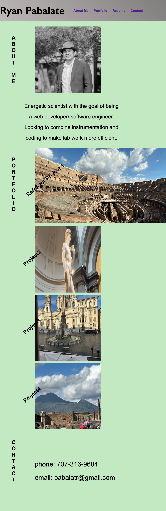

# Portfolio
***
## Description
This challenge was to create a portfolio.  The pictures in the portfolio section will link to examples of work.  Currently only project 1 works, which link to the refractor project.  The other pictures all lead to my github profile links.  

## Demo
To see the html, css files, and images go to terminal and open the desired folder and enter git clone 
git@github.com:rypab4/challenge_2.git. 
You can also find all folders and files in 
https://github.com/rypab4/challenge_2

## Usage
Example is an image of the website: first image is of the full window and the second image is of a smaller screen
https://rypab4.github.io/challenge_2/

